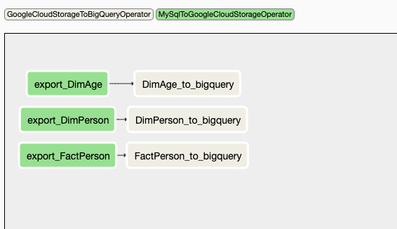
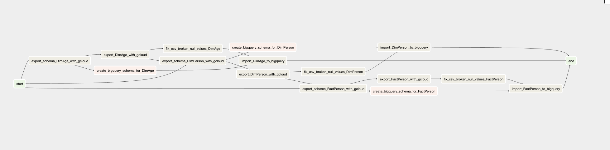

# gcp_cloudsql_airflow_bigquery
Example on how to export from cloud sql into bigquery, using airflow

In this example 3 tables are synced to bigquery

2 dimension tables, and one fact.

Each sync is a full table copy.  (this can be improved to use time/id in the sync select)

## Install
1. Copy content of dag folder into your own
2. Alter any credentials / etc you might need

### Sample of the job
Version2

Version 1 (old)

